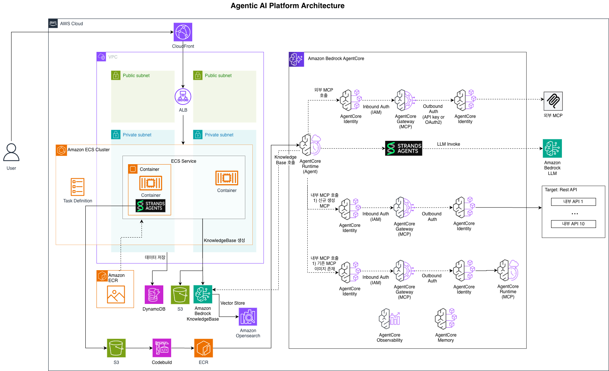

# Agentic AI Platform

An enterprise-grade AWS-powered platform for managing AI agents, MCP (Model Context Protocol) servers, and knowledge bases, built on Amazon Bedrock AgentCore and Strands Agents SDK.


**Table of Contents**
- [Overview](#overview)
- [Key Features](#key-features)
- [Architecture](#architecture)
- [Tech Stack](#tech-stack)
- [Project Structure](#project-structure)
- [Prerequisites](#prerequisites)
- [Getting Started](#getting-started)
- [Deployment](#deployment)
- [Documentation](#documentation)
- [License](#license)

## Overview

The Agentic AI Platform provides a unified interface for building, deploying, and managing AI-powered agents at scale. It streamlines the integration of multiple AI models, external tools through MCP servers, and enterprise knowledge bases, enabling organizations to rapidly develop sophisticated autonomous agents.

## Key Features

### 1. MCP Registry
Centrally register, deploy, and manage Model Context Protocol servers with multiple deployment patterns:

- **Internal Deploy**: Build MCP servers from source code → push to ECR → deploy to AgentCore Runtime → auto-discover tools via Gateway Target
- **Internal Create**: Define OpenAPI schemas → auto-generate MCP tools → containerize and deploy
- **External Connect**: Link external MCP endpoints or containers with OAuth2 authentication support
- **Tool Discovery**: Semantic search across registered tools with automatic indexing

### 2. Agent Management
Create, deploy, and manage AI agents with enterprise-grade features:

- **Multi-SDK Support**: Strands Agents SDK integration with standardized agent definitions
- **Multi-LLM Support**: Claude, Nova, and other Bedrock-supported models
- **Tool Integration**: Seamless MCP tool binding and Knowledge Base integration
- **Local Testing**: Sandbox environment for agent development and validation before deployment

### 3. Knowledge Base
Intelligent document indexing and retrieval using Amazon Bedrock Knowledge Base with OpenSearch Serverless:

- **Document Upload**: S3-based document ingestion with automatic Lambda processing
- **Semantic Search**: OpenSearch vector-based retrieval for precise knowledge retrieval
- **Version Management**: Track and manage multiple Knowledge Base versions
- **RAG Pipeline**: Integrated retrieval-augmented generation for grounded agent responses

### 4. Playground
Interactive development and testing environment:

- **Agent Code Generation**: AI-assisted agent definition and configuration
- **Build & Deploy**: One-click deployment to AgentCore Runtime
- **Testing Console**: Real-time agent interaction and debugging

## Architecture



## Tech Stack

### Backend
- **Framework**: FastAPI (Python 3.11+)
- **Architecture**: Domain-Driven Design (DDD)
- **AI Platforms**: Amazon Bedrock AgentCore, Strands Agents SDK
- **Databases**: DynamoDB (primary), OpenSearch Serverless (vector store)
- **Storage**: Amazon S3
- **MCP**: FastMCP with streamable-http transport
- **Observability**: AWS Distro for OpenTelemetry (ADOT)

### Frontend
- **Framework**: React 19 + TypeScript
- **Build Tool**: Vite
- **Styling**: Tailwind CSS
- **State Management**: Zustand
- **Package Manager**: pnpm workspaces

### Infrastructure
- **Compute**: ECS Fargate (containerized workloads)
- **Load Balancing**: Application Load Balancer (ALB)
- **CDN**: CloudFront (global content delivery)
- **Container Registry**: Amazon ECR
- **CI/CD**: GitLab CI/CD with Kaniko
- **IaC**: Terraform (dev, staging, prod environments)
- **Serverless**: Lambda, SQS, EventBridge, CodeBuild
- **Auth**: Amazon Cognito

### AI & Integration
- **LLMs**: Amazon Bedrock (Claude, Nova)
- **MCP Integration**: Model Context Protocol servers deployed and managed through the platform UI
- **Search**: OpenSearch Serverless for vector and semantic search

## Project Structure

```
agentic-ai-platform/
├── apps/
│   ├── backend/                      # FastAPI backend (DDD architecture)
│   │   ├── src/
│   │   │   ├── domain/               # Domain models and business logic
│   │   │   ├── application/          # Application services
│   │   │   ├── infrastructure/       # External integrations (AWS SDK, etc.)
│   │   │   └── presentation/         # API endpoints and HTTP handlers
│   │   ├── tests/                    # Unit and integration tests
│   │   └── pyproject.toml            # Python dependencies
│   │
│   └── frontend/                     # React + TypeScript (Vite)
│       ├── src/
│       │   ├── components/           # React components
│       │   ├── pages/                # Page components
│       │   ├── stores/               # Zustand state stores
│       │   ├── hooks/                # Custom React hooks
│       │   ├── types/                # TypeScript type definitions
│       │   └── utils/                # Utility functions
│       ├── public/                   # Static assets
│       └── package.json              # Node dependencies
│
├── infra/                            # Infrastructure as Code (Terraform)
│   ├── environments/
│   │   ├── dev/                      # Development environment
│   │   ├── staging/                  # Staging environment
│   │   └── prod/                     # Production environment
│   └── modules/                      # Reusable Terraform modules
│
├── packages/                         # Shared packages (monorepo)
│   ├── api-client/                   # TypeScript API client
│   ├── shared-types/                 # Shared type definitions
│   ├── shared-constants/             # Shared constants and enums
│   └── shared-utils/                 # Utility functions
│
├── scripts/                          # Build and utility scripts
├── docs/                             # Documentation
│   ├── getting-started.md            # Quick start guide
│   ├── architecture.md               # Detailed architecture documentation
│   ├── deployment.md                 # Deployment procedures
│   ├── development.md                # Development guide
│   ├── images/                       # Documentation images
│   └── security/                     # Security and compliance docs
│
└── .gitlab-ci.yml                    # CI/CD pipeline configuration
```

## Prerequisites

Before you begin, ensure you have the following installed:

- **Node.js** 18 or higher
- **Python** 3.11 or higher
- **pnpm** (package manager for Node.js monorepo)
- **AWS CLI** configured with appropriate credentials
- **Terraform** 1.0 or higher (for infrastructure management)

## Getting Started

### Installation

1. **Clone the repository**
   ```bash
   git clone https://github.com/your-org/agentic-ai-platform.git
   cd agentic-ai-platform
   ```

2. **Install dependencies**
   ```bash
   pnpm install
   ```

3. **Configure AWS credentials**
   ```bash
   aws configure
   ```

### Running the Development Server

Start both the backend API and frontend development server:

```bash
pnpm dev
```

This command will:
- Start the FastAPI backend server on `http://localhost:8000`
- Start the React frontend development server on `http://localhost:5173`
- Make the Swagger API documentation available at `http://localhost:8000/docs`

### Project-Specific Configuration

Refer to the project's [CLAUDE.md](./CLAUDE.md) for development environment setup specific to this codebase, including platform-specific development notes and configuration details.

## Deployment

### Automated CI/CD Pipeline

The project uses GitLab CI/CD with Kaniko for containerized builds and ECS Fargate for orchestration.

**Branch-based Deployment:**

| Branch Pattern | Environment | Behavior |
|---|---|---|
| `main` | Development | Automatic deployment on push |
| `release/*` | Production | Automatic deployment on push |

**Commit Message Modifiers:**

| Modifier | Effect |
|---|---|
| `[force-deploy]` | Force full rebuild and redeployment of all services |

**Deployment Process:**

1. Push code to `main` or `release/*` branch
2. GitLab CI pipeline triggers automatically
3. Kaniko builds container images for each service
4. Images are pushed to Amazon ECR
5. ECS Fargate tasks are updated with new images
6. CloudFront cache is invalidated (if applicable)

### Manual Deployment

For local or emergency deployments:

```bash
# Deploy infrastructure changes (requires Terraform)
cd infra/environments/prod
terraform plan
terraform apply

# Deploy specific service
pnpm deploy:backend
pnpm deploy:frontend
```

## Documentation

Comprehensive documentation is available in the `/docs` directory:

| Document | Purpose |
|---|---|
| [Getting Started](docs/getting-started.md) | Quick start guide and first-run setup |
| [Architecture](docs/architecture.md) | Detailed system architecture and design decisions |
| [Deployment](docs/deployment.md) | Production deployment procedures and troubleshooting |
| [Development](docs/development.md) | Development workflow, code standards, and testing |
| [Security](docs/security/) | Security policies and compliance documentation |

## License

MIT License - see LICENSE file for details

---

**For support and questions, please refer to the documentation or contact the development team.**
