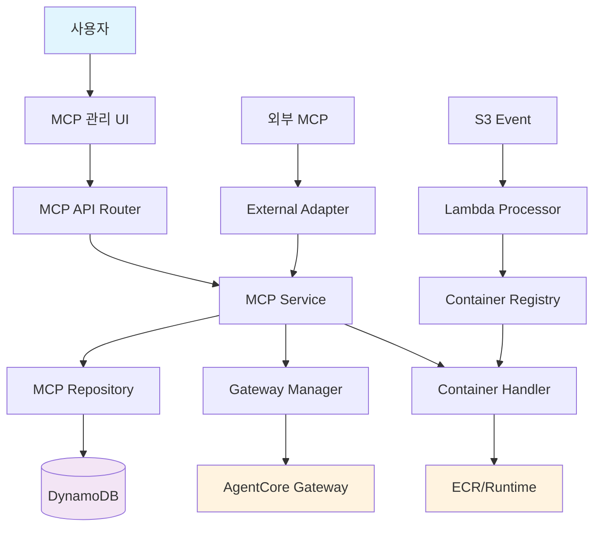
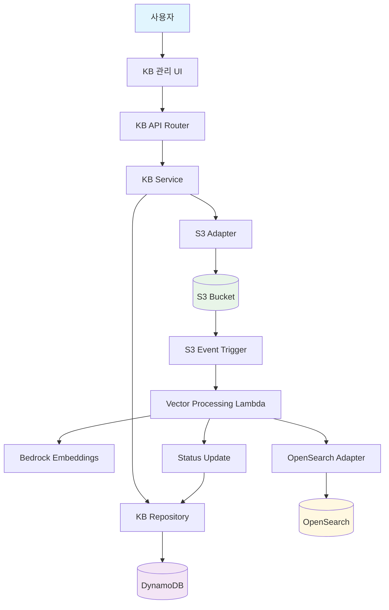
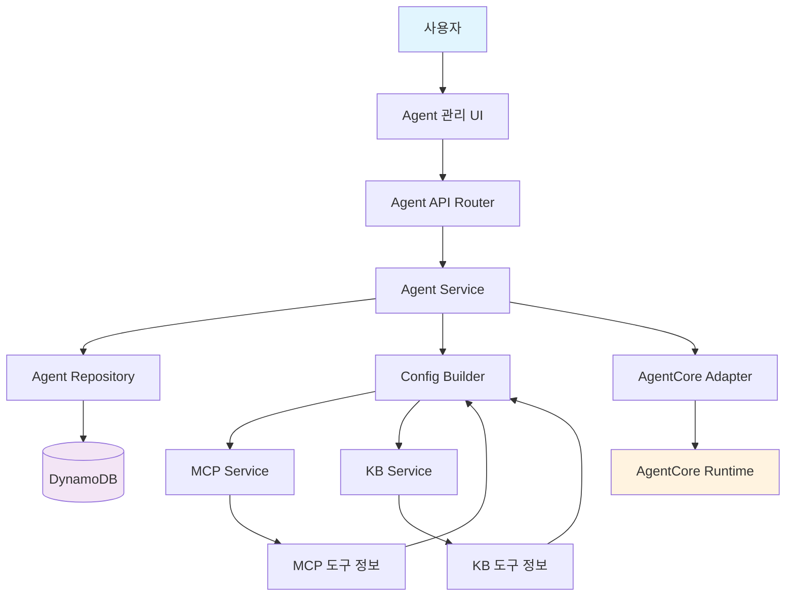
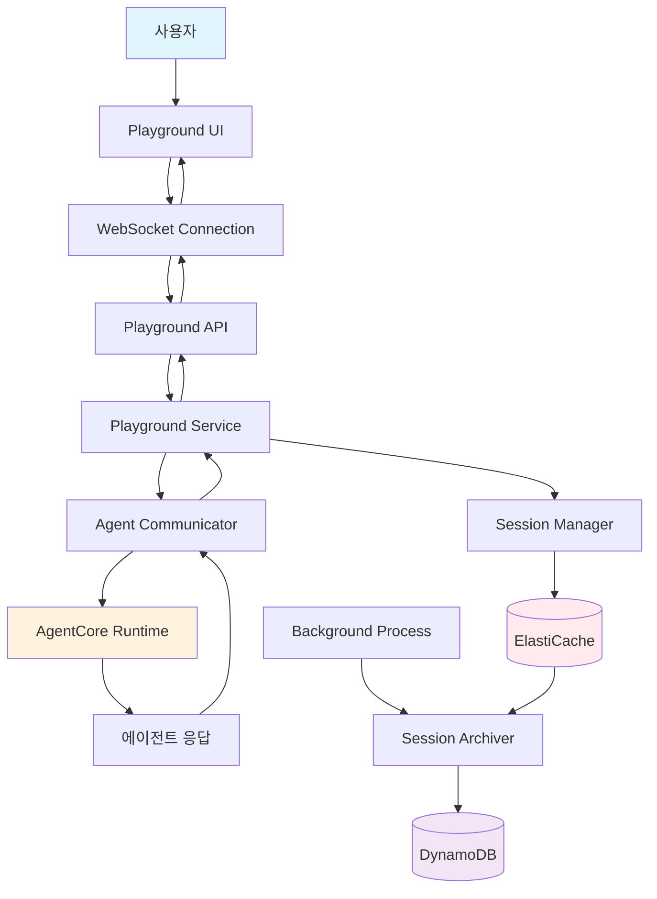

# 컴포넌트 의존성 분석 및 통신 패턴

## 의존성 매트릭스

### 프론트엔드 컴포넌트 의존성

#### React 컴포넌트 의존성 매트릭스
```
                    │ MCP  │ KB   │ Agent│ Play │ Shared│ API  │ State│
────────────────────┼──────┼──────┼──────┼──────┼───────┼──────┼──────┤
MCP Components      │  -   │  ○   │  ●   │  ○   │   ●   │  ●   │  ●   │
KB Components       │  ○   │  -   │  ●   │  ○   │   ●   │  ●   │  ●   │
Agent Components    │  ●   │  ●   │  -   │  ●   │   ●   │  ●   │  ●   │
Playground Comp.    │  ●   │  ●   │  ●   │  -   │   ●   │  ●   │  ●   │
Shared Components   │  -   │  -   │  -   │  -   │   -   │  ○   │  ○   │
API Services        │  -   │  -   │  -   │  -   │   -   │  -   │  ○   │
State Management    │  -   │  -   │  -   │  -   │   -   │  -   │  -   │

범례: ● 강한 의존성, ○ 약한 의존성, - 의존성 없음
```

#### 의존성 설명
- **강한 의존성 (●)**: 직접적인 import 및 사용
- **약한 의존성 (○)**: 간접적 참조 또는 선택적 사용

### 백엔드 서비스 의존성

#### 서비스 레이어 의존성 매트릭스
```
                    │ MCP  │ KB   │ Agent│ Play │ Repo │ AWS  │ Error│
────────────────────┼──────┼──────┼──────┼──────┼──────┼──────┼──────┤
MCP Service         │  -   │  ○   │  ○   │  -   │  ●   │  ●   │  ●   │
KB Service          │  ○   │  -   │  ○   │  -   │  ●   │  ●   │  ●   │
Agent Service       │  ●   │  ●   │  -   │  ○   │  ●   │  ●   │  ●   │
Playground Service  │  ●   │  ●   │  ●   │  -   │  ○   │  ●   │  ●   │
Repository Layer    │  -   │  -   │  -   │  -   │  -   │  ○   │  ●   │
AWS Adapters        │  -   │  -   │  -   │  -   │  -   │  -   │  ●   │
Error Handling      │  -   │  -   │  -   │  -   │  -   │  -   │  -   │
```

---

## 데이터 플로우 다이어그램

### 1. MCP 관리 데이터 플로우



### 2. 지식베이스 관리 데이터 플로우



### 3. 에이전트 관리 데이터 플로우



### 4. 플레이그라운드 데이터 플로우



---

## 통신 패턴

### 1. 프론트엔드-백엔드 통신

#### REST API 패턴
```typescript
// API 클라이언트 구조
interface APIClient {
  // MCP 관리
  mcp: {
    list: (filters?: MCPFilters) => Promise<MCPListResponse>
    create: (data: MCPCreateRequest) => Promise<MCPResponse>
    update: (id: string, data: MCPUpdateRequest) => Promise<MCPResponse>
    delete: (id: string) => Promise<void>
    getTools: (id: string) => Promise<MCPToolsResponse>
  }
  
  // 지식베이스 관리
  knowledgeBase: {
    list: (filters?: KBFilters) => Promise<KBListResponse>
    create: (data: KBCreateRequest) => Promise<KBResponse>
    uploadFiles: (id: string, files: File[]) => Promise<UploadResponse>
    getStatus: (id: string) => Promise<KBStatusResponse>
  }
  
  // 에이전트 관리
  agent: {
    list: (filters?: AgentFilters) => Promise<AgentListResponse>
    create: (data: AgentCreateRequest) => Promise<AgentResponse>
    deploy: (id: string) => Promise<DeploymentResponse>
    getConfig: (id: string) => Promise<AgentConfigResponse>
  }
  
  // 플레이그라운드
  playground: {
    createSession: (agentId: string) => Promise<SessionResponse>
    sendMessage: (sessionId: string, message: string) => Promise<ChatResponse>
    getHistory: (sessionId: string) => Promise<ChatHistoryResponse>
  }
}
```

#### WebSocket 통신 패턴 (플레이그라운드)
```typescript
interface WebSocketEvents {
  // 클라이언트 → 서버
  'chat:message': {
    sessionId: string
    message: string
    timestamp: number
  }
  
  'session:create': {
    agentId: string
  }
  
  'session:clear': {
    sessionId: string
  }
  
  // 서버 → 클라이언트
  'chat:response': {
    sessionId: string
    message: string
    timestamp: number
    tokenCount?: number
    processingTime?: number
  }
  
  'chat:error': {
    sessionId: string
    error: string
    timestamp: number
  }
  
  'session:created': {
    sessionId: string
    agentId: string
  }
  
  'agent:status': {
    agentId: string
    status: 'ready' | 'busy' | 'error'
  }
}
```

### 2. 백엔드 서비스 간 통신

#### 서비스 호출 패턴
```python
# 직접 서비스 호출 (같은 프로세스 내)
class AgentService:
    def __init__(self, 
                 mcp_service: MCPService,
                 kb_service: KnowledgeBaseService):
        self.mcp_service = mcp_service
        self.kb_service = kb_service
    
    async def build_agent_config(self, agent_data: AgentData) -> AgentConfig:
        # MCP 도구 정보 조회
        mcp_tools = []
        for mcp_ref in agent_data.mcp_tools:
            mcp_info = await self.mcp_service.get_mcp_with_tools(mcp_ref.mcp_id)
            mcp_tools.append(mcp_info)
        
        # KB 도구 정보 조회
        kb_tools = []
        for kb_ref in agent_data.kb_tools:
            kb_info = await self.kb_service.get_kb_info(kb_ref.kb_id)
            kb_tools.append(kb_info)
        
        return self.config_builder.build_config(agent_data, mcp_tools, kb_tools)
```

#### 이벤트 기반 통신 패턴
```python
# 도메인 이벤트 발행/구독
class EventBus:
    def __init__(self):
        self.handlers: Dict[str, List[Callable]] = {}
    
    def subscribe(self, event_type: str, handler: Callable):
        if event_type not in self.handlers:
            self.handlers[event_type] = []
        self.handlers[event_type].append(handler)
    
    async def publish(self, event: DomainEvent):
        if event.event_type in self.handlers:
            for handler in self.handlers[event.event_type]:
                await handler(event)

# 이벤트 핸들러 등록
event_bus.subscribe('MCP_CREATED', handle_mcp_created)
event_bus.subscribe('KB_PROCESSING_COMPLETED', handle_kb_processing_completed)
event_bus.subscribe('AGENT_DEPLOYED', handle_agent_deployed)

# 이벤트 발행
await event_bus.publish(MCPCreatedEvent(
    aggregate_id=mcp.mcp_id,
    data={'mcp_type': mcp.type, 'tools_count': len(mcp.tools)}
))
```

### 3. 외부 서비스 통신

#### AWS 서비스 어댑터 패턴
```python
# 기본 어댑터 인터페이스
class AWSServiceAdapter(ABC):
    def __init__(self, session: boto3.Session):
        self.session = session
    
    @abstractmethod
    async def health_check(self) -> bool:
        pass
    
    async def handle_aws_error(self, error: Exception) -> None:
        # AWS 공통 오류 처리
        pass

# 구체적인 어댑터 구현
class BedrockAdapter(AWSServiceAdapter):
    def __init__(self, session: boto3.Session):
        super().__init__(session)
        self.client = session.client('bedrock-runtime')
    
    async def generate_embeddings(self, texts: List[str]) -> List[List[float]]:
        try:
            response = await self.client.invoke_model(
                modelId='amazon.titan-embed-text-v1',
                body=json.dumps({'inputText': texts})
            )
            return self.parse_embedding_response(response)
        except Exception as e:
            await self.handle_aws_error(e)
            raise

class AgentCoreAdapter(AWSServiceAdapter):
    def __init__(self, session: boto3.Session):
        super().__init__(session)
        self.client = session.client('bedrock-agent-runtime')
    
    async def deploy_agent(self, agent_config: AgentConfig) -> DeploymentResult:
        try:
            response = await self.client.create_agent(
                agentName=agent_config.name,
                instruction=agent_config.instructions,
                foundationModel=agent_config.llm_model
            )
            return DeploymentResult.from_aws_response(response)
        except Exception as e:
            await self.handle_aws_error(e)
            raise
```

#### 재시도 및 회로 차단기 패턴
```python
import asyncio
from typing import Callable, Any
import time

class CircuitBreaker:
    def __init__(self, 
                 failure_threshold: int = 5,
                 recovery_timeout: int = 60,
                 expected_exception: type = Exception):
        self.failure_threshold = failure_threshold
        self.recovery_timeout = recovery_timeout
        self.expected_exception = expected_exception
        
        self.failure_count = 0
        self.last_failure_time = None
        self.state = 'CLOSED'  # CLOSED, OPEN, HALF_OPEN
    
    async def call(self, func: Callable, *args, **kwargs) -> Any:
        if self.state == 'OPEN':
            if time.time() - self.last_failure_time > self.recovery_timeout:
                self.state = 'HALF_OPEN'
            else:
                raise Exception("Circuit breaker is OPEN")
        
        try:
            result = await func(*args, **kwargs)
            self.on_success()
            return result
        except self.expected_exception as e:
            self.on_failure()
            raise e
    
    def on_success(self):
        self.failure_count = 0
        self.state = 'CLOSED'
    
    def on_failure(self):
        self.failure_count += 1
        self.last_failure_time = time.time()
        
        if self.failure_count >= self.failure_threshold:
            self.state = 'OPEN'

# 사용 예시
bedrock_circuit_breaker = CircuitBreaker(failure_threshold=3, recovery_timeout=30)

async def safe_bedrock_call(adapter: BedrockAdapter, texts: List[str]):
    return await bedrock_circuit_breaker.call(
        adapter.generate_embeddings, 
        texts
    )
```

---

## 의존성 주입 패턴

### 1. 서비스 컨테이너
```python
from typing import Dict, Type, Any, Callable
import inspect

class ServiceContainer:
    def __init__(self):
        self._services: Dict[str, Any] = {}
        self._factories: Dict[str, Callable] = {}
        self._singletons: Dict[str, Any] = {}
    
    def register_singleton(self, interface: Type, implementation: Type):
        """싱글톤 서비스 등록"""
        self._factories[interface.__name__] = implementation
    
    def register_transient(self, interface: Type, factory: Callable):
        """일시적 서비스 등록"""
        self._factories[interface.__name__] = factory
    
    def get(self, interface: Type) -> Any:
        """서비스 인스턴스 조회"""
        service_name = interface.__name__
        
        # 싱글톤 캐시 확인
        if service_name in self._singletons:
            return self._singletons[service_name]
        
        # 팩토리에서 생성
        if service_name in self._factories:
            factory = self._factories[service_name]
            
            # 의존성 주입
            if inspect.isclass(factory):
                dependencies = self._resolve_dependencies(factory)
                instance = factory(**dependencies)
                self._singletons[service_name] = instance
                return instance
            else:
                return factory()
        
        raise ValueError(f"Service {service_name} not registered")
    
    def _resolve_dependencies(self, cls: Type) -> Dict[str, Any]:
        """생성자 의존성 해결"""
        signature = inspect.signature(cls.__init__)
        dependencies = {}
        
        for param_name, param in signature.parameters.items():
            if param_name == 'self':
                continue
            
            if param.annotation != inspect.Parameter.empty:
                dependencies[param_name] = self.get(param.annotation)
        
        return dependencies

# 서비스 등록
container = ServiceContainer()
container.register_singleton(MCPRepository, MCPRepository)
container.register_singleton(MCPService, MCPService)
container.register_singleton(AgentService, AgentService)
```

### 2. FastAPI 의존성 주입
```python
from fastapi import Depends

# 의존성 팩토리 함수들
def get_database_connection():
    return DatabaseConnection()

def get_mcp_repository(db: DatabaseConnection = Depends(get_database_connection)):
    return MCPRepository(db)

def get_mcp_service(repository: MCPRepository = Depends(get_mcp_repository)):
    return MCPService(repository)

# 라우터에서 사용
@router.post("/mcps")
async def create_mcp(
    mcp_data: MCPCreateRequest,
    mcp_service: MCPService = Depends(get_mcp_service)
):
    return await mcp_service.create_mcp(mcp_data)
```

---

## 통신 최적화 전략

### 1. 배치 처리 패턴
```python
class BatchProcessor:
    def __init__(self, batch_size: int = 10, flush_interval: int = 5):
        self.batch_size = batch_size
        self.flush_interval = flush_interval
        self.batch: List[Any] = []
        self.last_flush = time.time()
    
    async def add_item(self, item: Any):
        self.batch.append(item)
        
        if (len(self.batch) >= self.batch_size or 
            time.time() - self.last_flush > self.flush_interval):
            await self.flush()
    
    async def flush(self):
        if self.batch:
            await self.process_batch(self.batch)
            self.batch.clear()
            self.last_flush = time.time()
    
    async def process_batch(self, items: List[Any]):
        # 배치 처리 로직
        pass
```

### 2. 캐싱 전략
```python
from functools import wraps
import json
import hashlib

def cache_result(ttl: int = 300):
    def decorator(func):
        @wraps(func)
        async def wrapper(*args, **kwargs):
            # 캐시 키 생성
            cache_key = f"{func.__name__}:{hash_args(args, kwargs)}"
            
            # 캐시에서 조회
            cached_result = await redis_client.get(cache_key)
            if cached_result:
                return json.loads(cached_result)
            
            # 함수 실행
            result = await func(*args, **kwargs)
            
            # 캐시에 저장
            await redis_client.setex(
                cache_key, 
                ttl, 
                json.dumps(result, default=str)
            )
            
            return result
        return wrapper
    return decorator

def hash_args(args, kwargs):
    """인자들을 해시로 변환"""
    content = str(args) + str(sorted(kwargs.items()))
    return hashlib.md5(content.encode()).hexdigest()

# 사용 예시
@cache_result(ttl=600)
async def get_mcp_with_tools(mcp_id: str) -> MCPWithTools:
    # 비용이 큰 조회 작업
    pass
```

### 3. 연결 풀링
```python
import asyncio
import aiohttp
from typing import Optional

class ConnectionPool:
    def __init__(self, max_connections: int = 100):
        self.max_connections = max_connections
        self.connector = aiohttp.TCPConnector(
            limit=max_connections,
            limit_per_host=20
        )
        self.session: Optional[aiohttp.ClientSession] = None
    
    async def get_session(self) -> aiohttp.ClientSession:
        if self.session is None or self.session.closed:
            self.session = aiohttp.ClientSession(connector=self.connector)
        return self.session
    
    async def close(self):
        if self.session and not self.session.closed:
            await self.session.close()

# 전역 연결 풀
connection_pool = ConnectionPool()

# AWS 어댑터에서 사용
class HTTPAdapter:
    async def make_request(self, url: str, data: dict):
        session = await connection_pool.get_session()
        async with session.post(url, json=data) as response:
            return await response.json()
```
