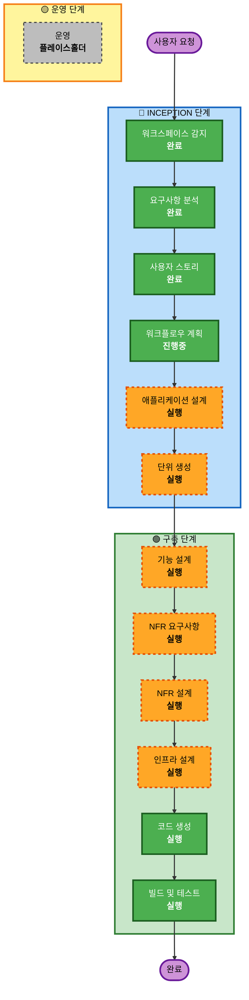

# 실행 계획

## 상세 분석 요약

### 변경 영향 평가
- **사용자 대면 변경**: 예 - 완전히 새로운 웹 플랫폼 구축
- **구조적 변경**: 예 - 다중 컴포넌트 아키텍처 (프론트엔드, 백엔드, 파일 처리, 에이전트 런타임)
- **데이터 모델 변경**: 예 - DynamoDB 스키마 설계, OpenSearch 벡터 인덱스 설계
- **API 변경**: 예 - 완전히 새로운 RESTful API 설계
- **NFR 영향**: 예 - 성능, 확장성, 보안 고려사항 포함

### 위험 평가
- **위험 수준**: 높음
- **롤백 복잡도**: 중간 (신규 프로젝트이므로 롤백보다는 재구축)
- **테스트 복잡도**: 복잡 (다중 서비스 통합, 실시간 처리, 외부 서비스 통합)

## 워크플로우 시각화

## 실행할 단계

### 🔵 INCEPTION 단계
- [x] 워크스페이스 감지 (완료)
- [x] 요구사항 분석 (완료)
- [x] 사용자 스토리 (완료)
- [x] 워크플로우 계획 (진행중)
- [ ] 애플리케이션 설계 - 실행
  - **근거**: 새로운 컴포넌트와 서비스 정의 필요, 비즈니스 규칙 명확화 필요
- [ ] 단위 생성 - 실행
  - **근거**: 복잡한 시스템을 관리 가능한 단위로 분해 필요

### 🟢 구축 단계
- [ ] 기능 설계 - 실행
  - **근거**: 새로운 데이터 모델 및 복잡한 비즈니스 로직 설계 필요
- [ ] NFR 요구사항 - 실행
  - **근거**: 성능, 확장성, 보안 고려사항 및 기술 스택 선택 필요
- [ ] NFR 설계 - 실행
  - **근거**: NFR 패턴을 아키텍처에 통합 필요
- [ ] 인프라 설계 - 실행
  - **근거**: AWS 서비스 매핑 및 배포 아키텍처 설계 필요
- [ ] 코드 생성 - 실행 (항상)
  - **근거**: 구현 접근법 필요
- [ ] 빌드 및 테스트 - 실행 (항상)
  - **근거**: 빌드, 테스트, 검증 필요

### 🟡 운영 단계
- [ ] 운영 - 플레이스홀더
  - **근거**: 향후 배포 및 모니터링 워크플로우

## 예상 타임라인
- **총 단계**: 11개
- **예상 기간**: 복잡한 다중 컴포넌트 플랫폼 개발

## 성공 기준
- **주요 목표**: 완전히 기능하는 agentic AI 플랫폼 구축
- **핵심 결과물**: 
  - React/TypeScript 프론트엔드 애플리케이션
  - Python/FastAPI 백엔드 API
  - AWS 인프라 구성 (DynamoDB, S3, OpenSearch, AgentCore)
  - 23개 사용자 스토리 구현
- **품질 게이트**: 
  - 모든 사용자 스토리 승인 기준 충족
  - 성능 요구사항 달성 (3초 응답 시간, 50명 동시 사용자)
  - AWS 서비스 통합 검증
